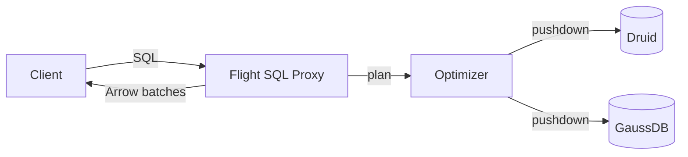

# Style rules

The target is a system design document: the query engine, the cache layer, the ADBC
connector. Its reader wants to know what each component does, under which condition,
with which values — and nothing else. Every rule below serves that.

## Precision

Every sentence states a fact about the system. A fact has a subject the reader can find
in the code, and usually a condition or a value.

| Vague | Precise |
|---|---|
| "The cache handles eviction appropriately." | "`CacheManager` evicts a `READY` entry `evictionGraceSeconds` (default 10 s) after its last hit." |
| "Various backends are supported." | "Three backends: Druid (ADBC), GaussDB (JDBC), StarRocks (MySQL protocol)." |
| "Queries may be slow in some cases." | "A query that misses the cache and scans > 1 B rows in Druid exceeds the 300 s ceiling." |
| "The connector manages connections." | "`AdbcConnector` opens one `AdbcDatabase` per backend at startup and one `AdbcConnection` per query; there is no pool." |

Rules:

- **Name the subject.** A class, component, config key, or table — as spelled in
  `CONTEXT.md`. Not "it", "the system", or "this" when more than one thing could be meant.
- **State the condition and the value.** When does it happen, with what number, in what
  unit. "Fast", "large", "frequently" are not values.
- **One claim per sentence.** Subject-verb-object, present tense, active voice. Under
  ~20 words. A sentence joined by "and", "which", or a semicolon usually holds two claims.
- **Say what is unknown, precisely.** When a fact is not established, write what is
  missing ("the default pool size is not set in code; it comes from the driver"), not
  a hedge ("probably", "typically").
- **Rationale is one line, labelled.** `Design choice: <decision> — <reason>.` Only for
  decisions the reader would otherwise question. Rationale comes from code or an
  `authored` source; never invent one.

No vague words: various, several (without a count), appropriate(ly), properly, as needed,
etc., and so on, a number of, in some cases, relevant. No marketing words: powerful,
seamless, robust, simply, easy, comprehensive, leverage.

## Cutting

Delete, without replacing:

- Preambles: "In this section we describe…", "This section covers…".
- Closing summaries of what was just said.
- Transitions: "Next, let's look at…", "Now that we have seen…".
- Sentences that restate the heading, a table, or a diagram in the same section.
- Motivation beyond one sentence — the reader of a design doc already knows why the
  system exists.
- A second explanation of the same mechanism. Explain it once, where the reader first
  needs it; elsewhere write `(§N)`.

| Instead of | Write |
|---|---|
| "It is important to note that the cache is optional." | "The cache is optional." |
| "In order to configure the connector, you will need to..." | "Configure the connector:" |
| "This provides the ability to push down filters." | "It pushes filters down." |

Deletion test — if a sentence can be removed and no fact is lost, remove it.

## Structure over paragraphs

- **Break down multi-point explanations.** Write a short bold lead-in, then one hyphen
  bullet per claim. A paragraph that makes three assertions is three bullets. No
  semicolons stacking two claims in one bullet.
- **Use a table whenever the content is a set of items with the same attributes**:
  components (`name | responsibility | module`), config (`key | default | effect`),
  states (`state | entered when | left when`), failures (`condition | fallback`),
  comparisons (`option | property A | property B`).
- A paragraph is right only for a single causal chain that does not split into items.

| Instead of | Write |
|---|---|
| "StarRocks as the main node. The client's query lands on the main cluster as the coordinator. Joins, aggregation, and result assembly run there, on StarRocks's own execution engine. The proxy's job is to get the right SQL in front of it (see §1's diagram)." | **StarRocks is the coordinator.**<br>- The client's query lands on the main StarRocks cluster.<br>- Joins, aggregation, and result assembly run on StarRocks's execution engine.<br>- The proxy rewrites the SQL before StarRocks sees it (§1). |

## Length

There are no word budgets. A section is as long as its facts require and no longer.

- An `overview` section states what the component is, how it fits, and one diagram.
  If it grows mechanism detail, that detail belongs in a mechanism section.
- A `mechanism` section carries class names, methods, state transitions, threading,
  config keys with defaults, and failure modes. Never cut one of these for length.
- Length is controlled by the precision and cutting rules above, the sentence gates in
  `metrics.py`, and the verifier's `PADDING` findings — not by a word count.

## Self-contained

The document set replaces the ingested docs for its reader.

- Never link to, name, or point at an ingested doc: no "see design-spec.md", no "as
  described in the benchmark report", no "further reading".
- Carry the fact itself. A measured number travels with its conditions inside the
  document: `0.82–8.28 M rows/s (6 query shapes, 10 M rows, 1 node, ADBC 1.2)`.
- Rationale from an `authored` doc is stated as a design choice, not attributed to the
  doc.
- Links inside the document set are fine: `§N` cross-references and links to companion
  files (`[config reference](query-engine/config-reference.md)`).
- The only external links allowed are public upstream specs (`external` sources), and
  only as further reading — the doc must still state every fact it relies on.
- Code paths are fine and encouraged: `cache/core/.../CacheManager.java` points into the
  system itself, not into another document.

## Mermaid diagrams

- One diagram answers one question. Name that question in the sentence above it.
- Max ~9 nodes and ~12 edges. A `Type: mechanism` section carrying one lifecycle or one
  execution-plan diagram may go to ~14 nodes and ~18 edges. Over that, decompose:
  - a top-level diagram of components, plus
  - one diagram per component's internals, or one per flow (read path, write path).
- Label an edge wherever it makes a choice: one of several leaving a node, or one of
  several arriving at one. An unnamed choice is an unstated claim, and it is where wrong
  assertions survive longest — prose gets read, edge labels get skimmed.
- A single-in, single-out step arrow may stay bare. It means "then", and labelling it
  restates the diagram. Label it anyway when it carries a payload worth naming
  (`Arrow batches`, `SQL`, `plan`).
- Use `flowchart LR` for topology, `sequenceDiagram` for ordered protocol steps,
  `erDiagram` for table relationships, `stateDiagram-v2` for a lifecycle / state
  machine. Nothing else unless the user asks.
- A `stateDiagram-v2` names the trigger on every transition edge — same rule as a
  flowchart branch. `SHADOW --> WARMING : promoteThreshold misses`, never a bare arrow.
- Node labels use `CONTEXT.md` names — the class or component, not a description.
- No colors or styling. Structure carries the meaning.
- Never diagram what one sentence already says.



## API examples

Every endpoint, method, or CLI command gets a runnable example. Required parts:

1. The call, with real-looking values (never `<your-value-here>` alone).
2. The response, trimmed to the fields that matter, marked `# trimmed` if cut.
3. One line on the failure case: status code or exception, and when it happens.

```bash
curl -s localhost:8080/v1/query \
  -H 'Content-Type: application/json' \
  -d '{"sql":"SELECT 1","catalog":"druid"}'
```

```json
{"queryId":"q-7f2a","rows":1,"schema":[{"name":"1","type":"INT32"}]}
```

`400 UNSUPPORTED_CATALOG` if `catalog` is not registered.

Signatures get types and a call site, not a prose description of each parameter:

```java
// Throws UnsupportedPushdownException if the predicate has no dialect mapping.
QueryPlan plan(String sql, CatalogRef catalog);
```

## SQL / use-case examples

Never show a query without its schema. Order: schema → query → result shape.

```sql
-- events(day DATE, user_id BIGINT, source VARCHAR(32), amount DECIMAL(12,2))  [Druid]
-- users(user_id BIGINT PRIMARY KEY, region VARCHAR(16))                       [GaussDB]

SELECT u.region, SUM(e.amount) AS revenue
FROM events e
JOIN users u ON u.user_id = e.user_id
WHERE e.day >= DATE '2026-01-01'
GROUP BY u.region;
```

Then one line on what the engine does with it:
"The `day` filter and the partial `SUM` push into Druid; the join runs in StarRocks."

Use the same table set across the whole document. Add new tables to `CONTEXT.md` so
later sections reuse them instead of inventing new ones.

## Experiment / measurement results

Any set of measured numbers (throughput, latency, memory, row counts, speedup
ratios — two or more comparable data points) goes in a table, never prose.

- One row per measured condition (rung, payload shape, arm, scale). One column per
  metric, each with its unit in the header (`rows/s`, `ms`, `GB peak`), not repeated
  in every cell.
- Comparative ratios (`×`, `%`) get their own column next to the raw numbers — a reader
  should never have to divide two cells themselves.
- Result sets not on the same axis (different harness, dataset, or scale) get separate
  tables — say why in a line above each table.
- A condition line above every table states what was measured and under what setup:
  dataset and row count, query shapes, hardware, versions. This replaces a citation;
  the reader has no source doc to look it up in.
- Long result sets go to a companion file; the main file keeps the one table that
  supports a design decision.

| Instead of | Write |
|---|---|
| "ADBC ran 815,662–8,278,277 rows/s against JDBC's 77,057–300,624, a 10.4x–27.1x gap, widest on numeric." | A condition line, then a table with columns Payload / JDBC rows/s / ADBC rows/s / ADBC×, one row per payload shape. |

## Language and assets

- Write prose in the language of the target document and its sources. All rules above
  apply regardless of language — short sentences, no filler, tables over paragraphs.
- Identifiers stay verbatim in every language: class names, methods, config keys,
  endpoint paths, SQL, JSON field names.
- Number the steps on diagram edges (`(1) declare CR`) when a flow has an order but is
  not a sequence diagram. Group layers with `subgraph`.
- Never invent an image URL. Missing screenshot → `<!-- TODO(user): ... -->` plus a
  question to the user.
- Redact secrets in examples as `<redacted>`, even if the source file has them in clear.
